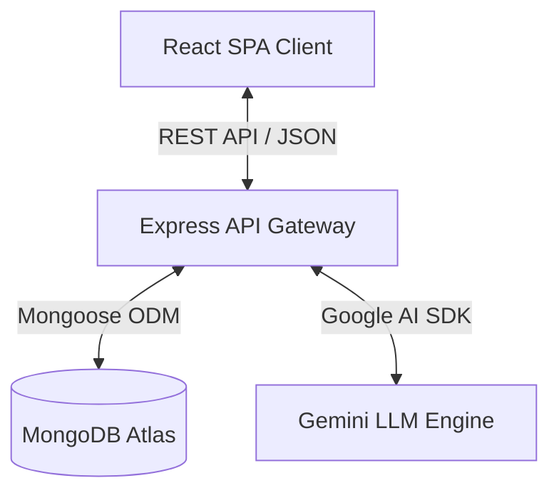

# 🎨 Infralab — Interactive System Design Workspace & Evaluation Lab

🔗 **[Live Interactive Demo](https://theinfralab.com/)**


Infralab is a premium, interactive SaaS platform designed to help engineers practice, simulate, and receive AI-driven feedback on system design architectures. 

Built with **React, TypeScript, Node.js, Express, and MongoDB**, it features a drag-and-drop design canvas, real-time request routing simulations, and automated design reviews.

---

## ✨ Features

*   **Interactive Design Canvas**: Built on top of React Flow, featuring custom grid guides, custom compute, networking, security, storage, and message-queue nodes.
*   **Request Flow Traffic Visualizer**: Simulate network request flows through your designed components. Watch data split dynamically across Load Balancers in a round-robin visual animation.
*   **AI-Assisted Architecture Grading**: Get real-time grading reports (Score, Strengths, Risks, and Optimization Suggestions) generated dynamically by a Large Language Model (LLM).
*   **Problem Bank**: Complete practice challenges ranging from Easy to Hard (e.g., *Design a URL Shortener*, *Design a Distributed Logger*, *Design Zoom*).
*   **Undo/Redo & Canvas Actions**: Fully integrated keyboard shortcuts (`Ctrl + Z` / `Ctrl + Y`) and panel controls using a custom state-history stack.
*   **Clean Dark Theme**: Sleek UI designed from scratch with Tailwind CSS.

---

## 📽️ UI Screenshots & Walkthrough

> [!NOTE]
> *Add your workspace screenshots and demo GIFs here to show off the user interface!*

| 🖥️ Custom Design Canvas 
| :---: | :---: |

|  

| 🤖 AI Evaluation Report |
| :---: | :---: |

| 
|

---

## 🏗️ System Architecture & Data Flow

Infralab separates concerns across an interactive React client, a secure Express API gateway, and a document store for designs and problem specifications.



### Flow of Execution for AI Grading
1. The user builds their system and clicks **Submit for Evaluation**.
2. The frontend extracts the graph schema (nodes with configurations, coordinates, and directed edges) and POSTs it to `/api/evaluation`.
3. The server retrieves the corresponding challenge details, formats a dense prompt context mapping requirements to components, and sends it to the **Gemini API**.
4. The Gemini LLM parses the layout, evaluates it against requirements, and returns a JSON payload matching the evaluation schema.
5. The frontend displays the results interactively, updating checklist requirements, score circles, and specific warning panels.

---

## 🛠️ Technology Stack

### Frontend
*   **Core**: React 19, TypeScript, Vite
*   **Canvas Engine**: `@xyflow/react` (React Flow v12) for node/edge graph visualization
*   **State Management**: `zustand` (lightweight state slices)
*   **State History**: `zundo` (time-travel undo/redo middleware)
*   **Styling**: `tailwindcss` (premium UI color system)

### Backend
*   **Runtime**: Node.js, TypeScript, Express.js
*   **Database**: MongoDB, Mongoose ODM
*   **Validation**: `zod` for HTTP request schemas
*   **Security**: `bcrypt` (password hashing), `jsonwebtoken` (session handling), `helmet` (security headers), and `express-rate-limit`

---

## 📂 Project Directory Structure

```
infralab/
├── system-design-lab/          # FRONTEND (React App)
│   ├── src/
│   │   ├── components/         # Reusable UI controls (Buttons, Cards, Modals)
│   │   ├── features/workspace/ # React Flow canvas, palette, configs, traffic simulation
│   │   ├── store/              # Zustand global store with Zundo undo/redo middleware
│   │   ├── pages/              # Landing, Canvas Workspace, Dashboard, Leaderboards
│   │   └── api/                # Axios API request clients
│   └── package.json
│
└── system-design-lab-backend/  # BACKEND (Express API)
    ├── src/
    │   ├── controllers/        # Express route request controllers
    │   ├── services/           # AI evaluation, auth, and database transactions
    │   ├── models/             # Mongoose schemas (User, Problem, Design)
    │   ├── validators/         # Zod API request schemas
    │   └── scripts/            # Database seeding and testing tools
    └── package.json
```

---

## 🚀 Getting Started

Follow these steps to run a local instance of Infralab.

### Prerequisites
*   Node.js (v18+)
*   MongoDB running locally or a MongoDB Atlas URI

### 1. Set Up the Backend
1. Navigate to the backend directory:
    ```bash
    cd system-design-lab-backend
    ```
2. Install dependencies:
    ```bash
    npm install
    ```
3. Create a `.env` file in the root of the backend folder and add:
    ```env
    PORT=5000
    MONGODB_URI=mongodb://localhost:27017/infralab
    JWT_SECRET=your_secret_jwt_key_here
    GEMINI_API_KEY=your_gemini_api_key_here
    CORS_ORIGIN=http://localhost:5173
    ```
    *(Note: If no `GEMINI_API_KEY` is provided, the backend automatically falls back to static mock evaluations so the app remains fully functional).*
4. Seed the database with mock users and the 10 practice problems:
    ```bash
    npm run seed
    ```
5. Start the development server:
    ```bash
    npm run dev
    ```
    The server will start on `http://localhost:5000`. You can access interactive Swagger documentation at `http://localhost:5000/api-docs`.

---

### 2. Set Up the Frontend
1. Navigate to the frontend directory:
    ```bash
    cd system-design-lab
    ```
2. Install dependencies:
    ```bash
    npm install
    ```
3. Create a `.env` file in the root of the frontend folder and add:
    ```env
    VITE_API_BASE_URL=http://localhost:5000/api
    VITE_GOOGLE_CLIENT_ID=your_google_client_id_here
    ```
4. Start the Vite development server:
    ```bash
    npm run dev
    ```
    The frontend will launch at `http://localhost:5173`.
